# PIM Agent - Hybrid RAG Product Information Management Agent

A conversational AI agent built on the **Fetch.ai uAgents framework** that provides intelligent product information retrieval using a **Hybrid RAG (Retrieval Augmented Generation)** architecture combining **MeTTa Knowledge Graphs** and **ChromaDB Vector Database**.

## 🎯 What It Does

The PIM Agent is a smart product assistant that:

1. **Understands natural language queries** about products (e.g., "Show me waterproof trail running shoes under $200")
2. **Retrieves relevant products** using semantic search (ChromaDB) and structured knowledge (MeTTa)
3. **Synthesizes intelligent responses** using the ASI-1 LLM
4. **Communicates via the Agent Chat Protocol** enabling chat through the Agentverse UI

### Example Queries

```
"What running shoes do you have for marathons?"
"Show me waterproof trail shoes"
"I need stability shoes for overpronation under $180"
"What's your most cushioned road running shoe?"
"Compare CloudTrail and TerraSprint shoes"
```

---

## 🏗️ Architecture Overview

```mermaid
flowchart TB
    subgraph External["☁️ External Communication"]
        UI["🖥️ Agentverse UI / ASI:One Chat"]
        Mailbox["📬 Agentverse Mailbox"]
    end

    subgraph Agent["🤖 PIM Agent"]
        direction TB
        Framework["⚙️ uAgents Framework"]
        ChatProto["💬 Chat Protocol v0.3.0"]
        
        subgraph RAG["🔍 Hybrid RAG System"]
            direction LR
            Vector["🗄️ ChromaDB<br/>Vector Store<br/><i>Semantic Search</i>"]
            KG["🕸️ MeTTa<br/>Knowledge Graph<br/><i>Structured Data</i>"]
        end
        
        LLM["🧠 ASI-1 LLM<br/><i>Response Synthesis</i>"]
    end

    subgraph Data["💾 Data Layer"]
        Catalog["📦 Product Catalog<br/><i>JSON</i>"]
    end

    UI -->|"ChatMessage"| Mailbox
    Mailbox -->|"ChatMessage"| ChatProto
    ChatProto --> Framework
    Framework --> RAG
    Vector -->|"Relevant UUIDs"| KG
    KG -->|"Enriched Context"| LLM
    LLM -->|"Natural Response"| ChatProto
    ChatProto -->|"ChatMessage"| Mailbox
    Mailbox -->|"Response"| UI
    Catalog -.->|"Ingest"| Vector
    Catalog -.->|"Ingest"| KG
```



---

## 🛠️ Technologies Used

### 1. **uAgents Framework** (Fetch.ai)
- **Purpose**: Core agent framework for building autonomous, decentralized agents
- **Features Used**:
  - `Agent` class for agent lifecycle management
  - `Protocol` for defining message handlers
  - `Context` for state management and message passing
  - Mailbox integration for cloud-based communication

### 2. **Agent Chat Protocol (v0.3.0)**
- **Purpose**: Standardized communication protocol for agent-to-agent and agent-to-UI messaging
- **Source**: `uagents_core.contrib.protocols.chat`
- **Message Types**:
  - `ChatMessage` - Main message container
  - `ChatAcknowledgement` - Message receipt confirmation
  - `TextContent` - Text payload
  - `StartSessionContent` / `EndSessionContent` - Session lifecycle

### 3. **Agentverse Mailbox**
- **Purpose**: Cloud-hosted message relay enabling local agents to receive messages from the internet
- **Why Needed**: Local agents behind NAT/firewalls cannot receive direct connections; Mailbox acts as a persistent endpoint
- **Configuration**: Set via `AGENTVERSE_MAILBOX_KEY` environment variable

### 4. **MeTTa Knowledge Graph** (Hyperon)
- **Purpose**: Structured knowledge representation and symbolic reasoning
- **Data Model**:
  ```metta
  (is_a <product_uuid> <family>)           ; Product taxonomy
  (has_category <product_uuid> <category>) ; Product categories
  (has_attribute <product_uuid> <attr> <value>) ; Product attributes
  ```
- **Queries**: Pattern matching for structured retrieval
- **Strengths**: Exact matches, relationships, attribute filtering

### 5. **ChromaDB Vector Store**
- **Purpose**: Semantic similarity search using embeddings
- **Embedding Model**: `all-MiniLM-L6-v2` (Sentence Transformers)
- **Storage**: Persistent local database (`./chroma_db`)
- **Strengths**: Natural language understanding, fuzzy matching, semantic relevance

### 6. **Hybrid RAG (Retrieval Augmented Generation)**
- **Purpose**: Combines Vector DB semantic search with Knowledge Graph structured retrieval
- **Flow**:
  1. User query → ChromaDB semantic search (find relevant products)
  2. Product UUIDs → MeTTa query (enrich with structured data)
  3. Combined context → LLM (synthesize natural response)

### 7. **ASI-1 LLM** (Fetch.ai)
- **Purpose**: Natural language generation for responses
- **Model**: `asi1-mini`
- **API Endpoint**: `https://api.asi1.ai/v1`
- **Usage**: Synthesizes product information into conversational responses

---

## 📁 File Structure

```
src/
├── pim_agent.py        # Main agent entry point (this file)
├── pim_rag.py          # MeTTa knowledge graph queries
├── pim_knowledge.py    # Knowledge graph initialization
├── pim_utils.py        # LLM wrapper and query processing
├── vector_store.py     # ChromaDB vector store operations
└── pim_agent_client.py # CLI client for testing

data/
└── updated_running_shoes_full_catalog.json  # Product catalog
```

---

## 🚀 Running the Agent Locally

### Prerequisites

1. **Python 3.10+** (required for `uagents-core`)
2. **ASI-1 API Key** from [asi1.ai](https://asi1.ai)
3. **Agentverse Account** from [agentverse.ai](https://agentverse.ai)

### Step 1: Set Up Environment

```bash
# Create virtual environment with Python 3.10+
python3.11 -m venv venv311
source venv311/bin/activate

# Install dependencies
pip install -r requirements.txt
```

### Step 2: Configure Environment Variables

Create a `.env` file in the project root:

```env
# Required
ASI_ONE_API_KEY=your_asi1_api_key_here
AGENT_SEED=pim_agent_seed_phrase

# Agent Configuration
AGENT_PORT=8006
AGENT_NAME="PIM Agent"

# Required for Agentverse UI Chat
AGENTVERSE_MAILBOX_KEY=your_mailbox_key_here

# Suppress warnings
TOKENIZERS_PARALLELISM=false
```

### Step 3: Get Your Mailbox Key

1. Go to [agentverse.ai](https://agentverse.ai)
2. Navigate to **Agents** → **My Agents**
3. Click **+ New Agent** → Select **Mailbox Agent**
4. Copy the generated **Mailbox API Key**
5. Paste into `.env` as `AGENTVERSE_MAILBOX_KEY`

### Step 4: Run the Agent

```bash
cd src
python pim_agent.py
```

**Expected Output:**
```
Loading .env from: /path/to/eComAgent/.env
.env exists: True
Configuring agent with Agentverse Mailbox...
Initializing Vector Store...
Starting PIM Agent on port 8006...
Using official AgentChatProtocol v0.3.0

INFO:     [PIM Agent]: PIM Agent started with address: agent1qd...
INFO:     [PIM Agent]: Using official AgentChatProtocol v0.3.0
INFO:     [PIM Agent]: Protocol digest: proto:a]8f5...
INFO:     [PIM Agent]: Agent inspector available at https://agentverse.ai/inspect/?uri=http%3A//127.0.0.1%3A8006&address=agent1qd...
INFO:     [PIM Agent]: Starting server on http://0.0.0.0:8006 (Press CTRL+C to quit)
INFO:     [PIM Agent]: Mailbox access token acquired
INFO:     [PIM Agent]: Mailbox session successfully resumed
```

---

## 💬 Chatting with the Agent via Agentverse UI

### Option 1: Agent Inspector Link (from logs)

1. Look for this line in the agent logs:
   ```
   Agent inspector available at https://agentverse.ai/inspect/?uri=...
   ```
2. Open the URL in your browser
3. Click **"Chat with Agent"**

### Option 2: Direct Agentverse Chat

1. Go to [agentverse.ai](https://agentverse.ai)
2. Navigate to **Agents** tab
3. Find your **PIM Agent** (should show as "Active")
4. Click on the agent → **Chat**

### Option 3: ASI:One Chat Interface

1. Go to [asi1.ai/chat](https://asi1.ai/chat)
2. Click **"+ New Chat"**
3. Search for your agent by address or name
4. Start chatting!

---

## 🧪 Testing Locally (without Agentverse)

Use the CLI client to test the agent locally:

```bash
# In a separate terminal
cd src
python pim_agent_client.py "Show me waterproof trail running shoes"
```

**Expected Output:**
```
Received Response: Based on the product catalog, here are the waterproof trail running shoes available:

1. **TerraSprint Trail Master** ($179.99)
   - Waterproof Gore-Tex membrane
   - Aggressive Vibram outsole
   - 8mm drop, 295g weight
   ...
```

---

## 🔧 Troubleshooting

### "AGENTVERSE_MAILBOX_KEY not found"
- Ensure `.env` file is in project root (not in `src/`)
- Check the key is not commented out

### "Chat messages not appearing in logs"
- Verify Mailbox is connected (look for "Mailbox session successfully resumed")
- Ensure you're using the Agent Chat Protocol link, not direct HTTP

### "ModuleNotFoundError: uagents_core"
- Requires Python 3.10+
- Install with: `pip install uagents-core`

### "LLM API Error"
- Check `ASI_ONE_API_KEY` is valid
- Verify internet connectivity

---

## 📊 Data Source

The agent uses `data/updated_running_shoes_full_catalog.json` containing:

- **10 Running Shoe Brands**: AeroStride, CloudTrail, FleetStep, etc.
- **50 Products** with detailed attributes
- **Attributes**: Price, Material, Weight, Drop, Cushioning, Reviews, etc.

---

## 🔗 Related Files

| File | Purpose |
|------|---------|
| `context_agent.py` | Raw context retrieval agent (no LLM) |
| `pim_agent_client.py` | CLI client for testing |
| `mcp/context_mcp_server_agent.py` | MCP server for Claude Desktop |

---

## 📚 References

- [uAgents Documentation](https://docs.fetch.ai/uAgents/)
- [Agent Chat Protocol](https://uagents.fetch.ai/docs/guides/chat_protocol)
- [Agentverse Documentation](https://docs.fetch.ai/agentverse/)
- [MeTTa Language](https://metta-lang.dev/)
- [ChromaDB Documentation](https://docs.trychroma.com/)
- [ASI-1 API](https://asi1.ai/docs)

